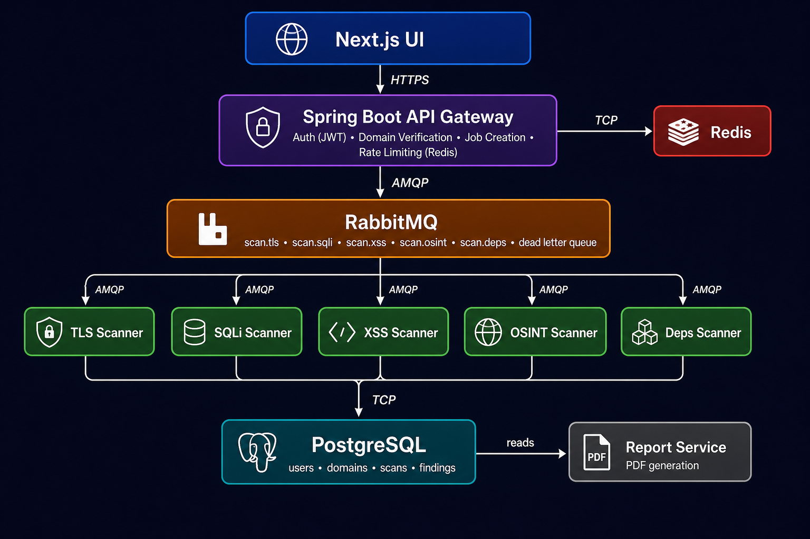

# Architecture

## System Overview

Sentinel is built as a microservices system. The API Gateway (Spring Boot) handles authentication, domain verification, and job creation. Scanner workers (Python/FastAPI) consume jobs from RabbitMQ queues and write findings to PostgreSQL. The frontend (Next.js) polls scan status and renders results.

## Why Microservices, Not a Monolith?

Each scanner operates independently. TLS, SQLi, XSS, OSINT, and dependency scanning have no data dependency on each other. This means all five can run in parallel for a given scan. Additionally, if one scanner crashes, the others continue unaffected; in a monolith, a single failure would bring down the entire system.

## Services

| Service | Language | Responsibility |
|---------|----------|----------------|
| `api-gateway` | Java / Spring Boot | Auth, domain verification, job dispatch, rate limiting |
| `scanner-tls` | Python / FastAPI | TLS version, certificate expiry, security headers |
| `scanner-sqli` | Python / FastAPI | SQL injection detection (error, time, boolean-based) |
| `scanner-xss` | Python / FastAPI | Reflected XSS detection |
| `scanner-osint` | Python / FastAPI | Subdomain enumeration, tech fingerprinting, CVE matching |
| `scanner-deps` | Python / FastAPI | Dependency CVE scanning via NVD API |
| `report-service` | Python | PDF report generation |
| `frontend` | Next.js | Dashboard UI |

## Communication

| From | To | Protocol | Purpose |
|------|----|----------|---------|
| Frontend | API Gateway | HTTPS | All user-facing API calls |
| API Gateway | RabbitMQ | AMQP | Publish scan jobs |
| Scanners | RabbitMQ | AMQP | Consume scan jobs |
| Scanners | PostgreSQL | TCP | Persist findings |
| API Gateway | Redis | TCP | Rate limiting, session cache |
| Report Service | PostgreSQL | TCP | Read findings for PDF |

## Architecture Decision Records

Major decisions are documented as ADRs in [`docs/adr/`](docs/adr/):

- [ADR-0001 — Microservices Architecture](docs/adr/0001-microservices-architecture.md)
- [ADR-0002 — RabbitMQ Selection](docs/adr/0002-rabbitmq-selection.md)
- [ADR-0003 — Domain Verification Approach](docs/adr/0003-domain-verification.md)
